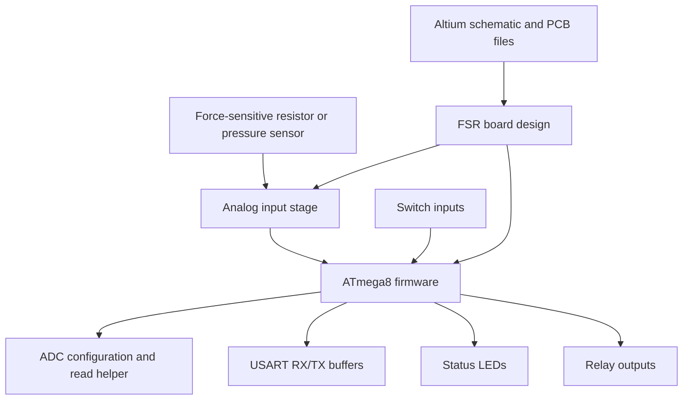
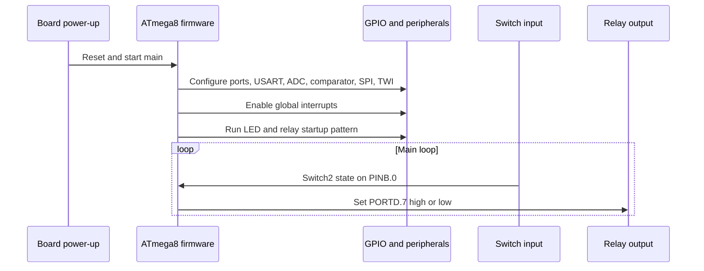

# FSR

Force-sensitive resistor hardware and AVR firmware reference for pressure-sensing experiments in robotic gripping and embedded control.

FSR is a compact hardware/firmware repository for a custom force-sensitive resistor board. It combines an Altium PCB project with an ATmega8 firmware project generated for CodeVisionAVR. The design is intended for pressure-sensing workflows where a robot, test rig, or embedded controller needs to read analog sensor behavior and actuate simple outputs such as relays or indicators.

The repository currently functions best as a reference design and firmware baseline. It includes the schematic and PCB source files, the AVR C source, CodeVisionAVR/Atmel Studio project metadata, and historical/generated build outputs. Manufacturing outputs, calibrated sensor-processing firmware, and automated tests are not yet documented.

## What This Project Does

Force-sensitive resistors produce analog signals that change with applied pressure. In robotics and embedded systems, that signal can help detect contact, estimate grip force, or trigger control logic when an object is touched.

This repository provides:

- An Altium Designer PCB project for the FSR board.
- An ATmega8 firmware project configured for CodeVisionAVR.
- Firmware setup for GPIO, USART, ADC, LEDs, relays, and switch inputs.
- A simple runtime loop that maps one switch input to one relay output.
- Generated debug artifacts from the original firmware build.

The firmware contains ADC initialization and an ADC read helper, but the current main loop does not yet publish calibrated FSR readings or implement a complete pressure-control algorithm. Treat the analog sensing path as present in the firmware baseline and hardware intent, but requiring validation before reuse in a production robot.

## Who It Is For

| Audience | Why this repository may be useful |
|---|---|
| Embedded developers | Inspect or adapt an ATmega8 firmware baseline for GPIO, USART, ADC, and relay control. |
| Robotics builders | Use the design as a starting point for pressure-sensing gripper experiments. |
| Hardware engineers | Review the Altium schematic and PCB files for a force-sensing board design. |
| Students and researchers | Study a small mixed hardware/firmware project that connects sensor inputs to actuator outputs. |
| Maintainers | Modernize the repository with clean release outputs, docs, tests, and licensing. |

## Architecture

The project has two main layers: the hardware design package and the microcontroller firmware package.



The Altium project defines the board-level schematic and PCB documents. The firmware project targets the ATmega8 and configures the microcontroller peripherals used by the board. The currently implemented firmware behavior is intentionally simple: initialize peripherals, flash indicators/relay outputs during startup, then drive `Relay1` from `Switch2`.



## Core Components

| Component | Responsibility | Inputs | Outputs | Source |
|---|---|---|---|---|
| PCB project | Stores the board-level schematic, PCB layout, output configuration, and Altium project metadata. | Schematic and PCB design files | Altium project that can generate documentation, fabrication, validation, and export outputs | `FSR_Project/` |
| Firmware project | Defines the CodeVisionAVR/Atmel Studio project for the ATmega8 target. | `FSRV1.c`, CodeVisionAVR settings | Debug/release AVR executable outputs | `FSR Board/FSRV1.cproj`, `FSR Board/FSRV1.prj` |
| AVR firmware | Initializes MCU peripherals and implements the current control loop. | Switch inputs, configured ADC channels, USART input | Relay, LED, USART, and ADC behavior | `FSR Board/FSRV1.c` |
| Generated build artifacts | Preserve the historical compiled firmware outputs and listings. | CodeVisionAVR build | `.hex`, `.cof`, `.asm`, `.lst`, `.map`, object files | `FSR Board/Debug/` |
| Design history and logs | Preserve Altium backup archives and ECO logs from the original PCB work. | Altium Designer project edits | Historical zip backups and project logs | `FSR_Project/History/`, `FSR_Project/Project Logs for FSR_Project/` |

## Features

### Implemented

- **Altium PCB source project.** The repository includes both schematic and PCB documents under `FSR_Project/`.
- **ATmega8 firmware target.** The firmware project is configured for an ATmega8 running at 14.745600 MHz.
- **Peripheral initialization.** The firmware initializes GPIO, USART, ADC, analog comparator, SPI, and TWI registers.
- **USART buffering.** Interrupt-driven receive and transmit buffers are present for serial communication.
- **ADC helper path.** The firmware includes ADC interrupt handling and a `read_adc` helper using ADC noise-reduction sleep mode.
- **Relay and LED outputs.** Startup output patterns and switch-controlled relay logic are implemented.
- **Historical build outputs.** Debug build outputs include compiled artifacts and generated listings from the original toolchain.

### Planned or Requires Validation

- Calibrated FSR pressure-reading logic.
- Serial output protocol for sensor readings.
- Manufacturing-ready release package with Gerbers, drill files, BOM, and assembly notes.
- Hardware validation notes for sensor ranges, power limits, relay load limits, and connector pinout.
- Automated firmware build instructions outside the original CodeVisionAVR environment.

## Technology Stack

| Layer | Technology | Purpose |
|---|---|---|
| PCB design | Altium Designer project files | Schematic capture, PCB layout, and board outputs |
| Microcontroller | ATmega8 | Embedded control target |
| Firmware language | C | MCU initialization and runtime behavior |
| Firmware toolchain | CodeVisionAVR 3.12 Advanced | Original firmware generation and compilation environment |
| IDE integration | Atmel Studio project metadata | Project wrapper referencing the CodeVisionAVR project |
| Build artifacts | Intel HEX, COF, list/map files | Historical compiled outputs and debug information |

## Quick Start

This repository does not include a cross-platform scripted build. The verified project entry points are the native hardware and firmware project files.

### 1. Clone the Repository

```bash
git clone https://github.com/Pouya-Mansournia/FSR.git
cd FSR
```

### 2. Review the Hardware Design

Open the Altium Designer project:

```text
FSR_Project/FSR_Project.PrjPcb
```

The project references:

- `FSR_Project/FSR-PRJ.SchDoc`
- `FSR_Project/FSR-PRJ.PcbDoc`

Use Altium Designer to inspect the schematic, PCB layout, design rules, and output-job configuration. Manufacturing outputs should be regenerated and reviewed before fabrication.

### 3. Review or Build the Firmware

Open the firmware project in an environment with CodeVisionAVR support:

```text
FSR Board/FSRV1.cproj
```

The project references:

```text
FSR Board/FSRV1.prj
FSR Board/FSRV1.c
```

The original project metadata targets:

| Setting | Value |
|---|---|
| MCU | ATmega8 |
| Clock | 14.745600 MHz |
| Program type | Application |
| Memory model | Small |
| USART baud rate | 115200 |
| ADC reference | AVCC |

### 4. Smoke Check

Without the proprietary tools installed, the safest local smoke check is a repository inspection:

```bash
git status --short
```

With CodeVisionAVR available, rebuild the `FSRV1` project and verify that the generated output matches the expected target device and clock. The checked-in project metadata records a historical debug build with no errors and one warning, but that should be treated as historical evidence rather than a current build guarantee.

## Configuration

The current firmware configuration is defined directly in `FSR Board/FSRV1.c` and `FSR Board/FSRV1.prj`.

| Configuration | Current value | Source |
|---|---|---|
| MCU | `ATmega8` | `FSR Board/FSRV1.prj` |
| Clock | `14.745600 MHz` | `FSR Board/FSRV1.c`, `FSR Board/FSRV1.prj` |
| USART | `115200`, 8 data bits, 1 stop bit, no parity | `FSR Board/FSRV1.c` |
| ADC reference | `AVCC` | `FSR Board/FSRV1.c` |
| Switch 2 input | `PINB.0` | `FSR Board/FSRV1.c` |
| Relay 1 output | `PORTD.7` | `FSR Board/FSRV1.c` |
| Relay 2 output | `PORTD.5` | `FSR Board/FSRV1.c` |
| LED outputs | `PORTB.1`, `PORTB.2` | `FSR Board/FSRV1.c` |

No `.env` file or runtime secret configuration is used.

## Usage

### Hardware Review Workflow

1. Open `FSR_Project/FSR_Project.PrjPcb` in Altium Designer.
2. Inspect `FSR-PRJ.SchDoc` for circuit intent and component connectivity.
3. Inspect `FSR-PRJ.PcbDoc` for layout, routing, and board constraints.
4. Run ERC/DRC inside Altium before manufacturing.
5. Regenerate Gerber, drill, BOM, and assembly outputs from the project.

### Firmware Review Workflow

1. Open `FSR Board/FSRV1.cproj`.
2. Review `FSR Board/FSRV1.c`.
3. Confirm the ATmega8 clock and fuse assumptions for your target board.
4. Rebuild with CodeVisionAVR.
5. Flash the resulting firmware only after validating the board power, relay loads, and programming interface.

### Current Runtime Behavior

At startup, the firmware:

1. Configures GPIO direction and default output states.
2. Stops timers 0, 1, and 2.
3. Enables USART RX/TX with interrupt-driven buffers.
4. Enables ADC with AVCC reference.
5. Disables analog comparator, SPI, and TWI.
6. Enables global interrupts.
7. Pulses LED and relay outputs as a startup indication.
8. Enters a loop where `Switch2 == 0` turns `Relay1` on; otherwise `Relay1` is off.

## Interface Reference

### Firmware I/O Map

| Symbol | MCU pin expression | Direction | Role |
|---|---|---:|---|
| `Switch1` | `PIND.6` | Input | Declared switch input; not used in the current main loop |
| `Switch2` | `PINB.0` | Input | Relay control input used in the current main loop |
| `Relay1` | `PORTD.7` | Output | Main relay output |
| `Relay2` | `PORTD.5` | Output | Declared relay output; initialized but not used in the current main loop |
| `Led1` | `PORTB.1` | Output | Startup indicator |
| `Led2` | `PORTB.2` | Output | Startup indicator |

### Firmware Functions

| Function | Purpose | Notes |
|---|---|---|
| `usart_rx_isr` | Receives USART data into a circular buffer | Ignores bytes with framing, parity, or overrun errors |
| `getchar` | Reads from the USART receive buffer | Blocks until data is available |
| `usart_tx_isr` | Sends queued USART data | Uses the transmit complete interrupt |
| `putchar` | Queues or writes a byte to USART | Blocks while the transmit buffer is full |
| `adc_isr` | Stores the latest ADC conversion result | Updates global `adc_data` |
| `read_adc` | Selects an ADC input and reads the conversion result | Uses ADC noise-reduction sleep mode |
| `main` | Initializes peripherals and runs the relay loop | Current application entry point |

## Folder Structure

```text
FSR/
|-- README.md                         # Project overview and usage guide
|-- FSR Board/
|   |-- FSRV1.c                       # ATmega8 firmware source
|   |-- FSRV1.cproj                   # Atmel Studio/CodeVisionAVR project wrapper
|   |-- FSRV1.prj                     # CodeVisionAVR project settings
|   |-- FSRV1.atsln                   # Atmel Studio solution
|   |-- Debug/                        # Historical generated firmware build outputs
|   |   |-- Exe/                      # HEX, COF, and linker outputs
|   |   `-- List/                     # Assembly, list, and map outputs
|   `-- FSRV1.*                       # Toolchain metadata and generated files
|-- FSR_Project/
|   |-- FSR_Project.PrjPcb            # Altium Designer PCB project
|   |-- FSR-PRJ.SchDoc                # Schematic document
|   |-- FSR-PRJ.PcbDoc                # PCB layout document
|   |-- __Previews/                   # Altium preview files
|   |-- History/                      # Altium backup archives
|   `-- Project Logs for FSR_Project/ # Altium ECO logs
|-- CONTRIBUTING.md                   # Contribution workflow
|-- SECURITY.md                       # Security and safety reporting guidance
|-- .github/
|   |-- ISSUE_TEMPLATE/               # Bug and feature request templates
|   `-- PULL_REQUEST_TEMPLATE.md      # Pull request checklist
`-- ROADMAP.md                        # Maintenance and documentation roadmap
```

## Examples and Use Cases

| Use Case | Input | Output | Relevant Files |
|---|---|---|---|
| Robotic gripper contact experiment | Pressure sensor or switch input | Relay/indicator response | `FSR Board/FSRV1.c`, `FSR_Project/` |
| Hardware design review | Altium project files | Schematic and PCB inspection | `FSR_Project/FSR_Project.PrjPcb` |
| Firmware modernization | Existing CodeVisionAVR C source | Cleaner AVR firmware baseline | `FSR Board/FSRV1.c` |
| Manufacturing preparation | PCB project | Regenerated fabrication package | `FSR_Project/FSR-PRJ.PcbDoc` |

## Testing and Quality

No automated tests, CI workflow, or scripted firmware build are currently present.

Verified from repository evidence:

- Firmware project metadata records a historical CodeVisionAVR debug build with no errors and one warning.
- The Altium project includes output groups for documentation, assembly, fabrication, reports, validation, and export outputs.
- Generated firmware artifacts are present under `FSR Board/Debug/`.

Recommended checks before hardware reuse:

- Rebuild the firmware from source in CodeVisionAVR.
- Run Altium electrical rules checks and design rules checks.
- Regenerate fabrication outputs from the current PCB project.
- Validate relay load limits, board power input, programming headers, sensor pinout, and analog scaling.
- Add firmware tests or hardware-in-the-loop smoke tests for ADC behavior.

## Deployment

This is an embedded hardware project, so deployment means programming a physical ATmega8-based board.

Current verified deployment artifact:

```text
FSR Board/Debug/Exe/FSRV1.hex
```

Before flashing hardware:

1. Rebuild the firmware with the expected clock and fuse settings.
2. Confirm the target board matches the checked-in schematic and PCB.
3. Confirm relay load and supply constraints.
4. Use an AVR-compatible programmer suitable for the ATmega8.
5. Verify behavior on a bench supply before connecting a robot or external load.

## Security and Safety

This repository does not currently include a dedicated vulnerability policy, hardware safety documentation, or production deployment checklist.

Important boundaries:

- No network service or authentication layer is present.
- No secrets or environment variables are required.
- Relay outputs may control external electrical loads; validate load ratings and isolation before use.
- Sensor readings and relay behavior should be validated on a bench before connecting to actuated machinery.
- The checked-in firmware is a baseline and should not be treated as safety-rated control software.

See `SECURITY.md` for reporting guidance and safety notes.

## Limitations

- No license file is currently present. Add a license before treating the repository as reusable open-source software.
- No manufacturing release package is documented.
- No BOM, assembly drawings, calibrated sensor curves, or pinout table are currently documented.
- The current firmware does not implement a complete calibrated FSR pressure algorithm.
- The build relies on CodeVisionAVR project metadata and may not build with a standard GCC AVR toolchain without porting.
- Generated build outputs and Altium history archives are checked into the repository; maintainers may want to prune or release them separately.
- Hardware validation status is not documented.

## Roadmap

See `ROADMAP.md` for the active maintenance roadmap.

### Completed

- Altium schematic and PCB project committed.
- ATmega8 firmware source committed.
- Historical CodeVisionAVR debug build artifacts committed.
- Repository README rewritten with architecture, setup, usage, and limitations.

### In Progress

- Documentation cleanup and GitHub repository presentation improvements.

### Planned

- Add an open-source license.
- Add manufacturing outputs or documented generation steps.
- Document board pinout, BOM, sensor range, and relay constraints.
- Add calibrated ADC-to-pressure processing or clearly document expected external processing.
- Add firmware build verification instructions for a reproducible toolchain.

## Contributing

Contributions are welcome after the repository licensing question is resolved.

Useful contribution areas:

- Hardware documentation and pinout tables.
- BOM and fabrication package generation.
- Firmware cleanup or AVR-GCC porting.
- ADC sampling, filtering, calibration, and serial reporting.
- Bench-test documentation and photos.
- CI or static checks for documentation and source formatting.

Start with `CONTRIBUTING.md` before opening a pull request.

## Community and Support

Use GitHub Issues for questions, bug reports, documentation gaps, and proposed improvements. No separate chat, forum, or mailing-list channel is currently documented.

## License

No license file is currently present. Add a license before treating the repository as reusable open-source software.

## Maintainer

Maintained by [Pouya Mansournia](https://github.com/Pouya-Mansournia).
